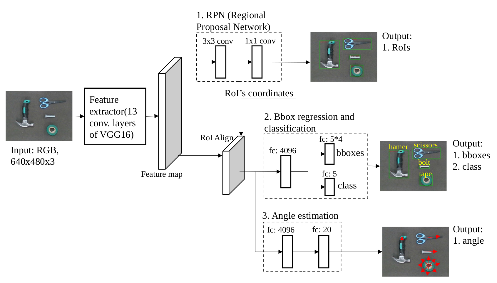

# Robotic Grasping (pick-and-place) using  Faster R-CNN 

In this work, we present a Faster RCNN based multi-task network that is able to simultaneously perform several tasks, objection detection, classification and angle estimation. The outputs of all three tasks are then passed through a pick-and-place robot arm system. The robot arm uses the detection, angle estimation, classification to decide a picking point, a rotated gripper angle, and a specified box, respectively. The test results show that our network achieves a mean average precision of 86.6% at IoU (intersection over union) of 0.7, and a mean accuracy of 83.5% in object detection and angle estimation, respectively. In addition, the proposed multi-task network just takes 0.072s to process one image, which is really suitable for pick-and-place robot arms.

This implementation is based on the implementation of [jwyang/faster-rcnn.pytorch](https://github.com/jwyang/faster-rcnn.pytorch)

